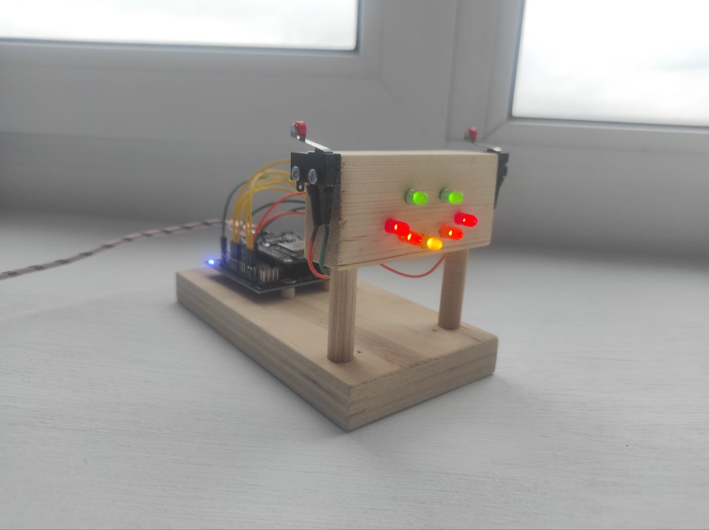
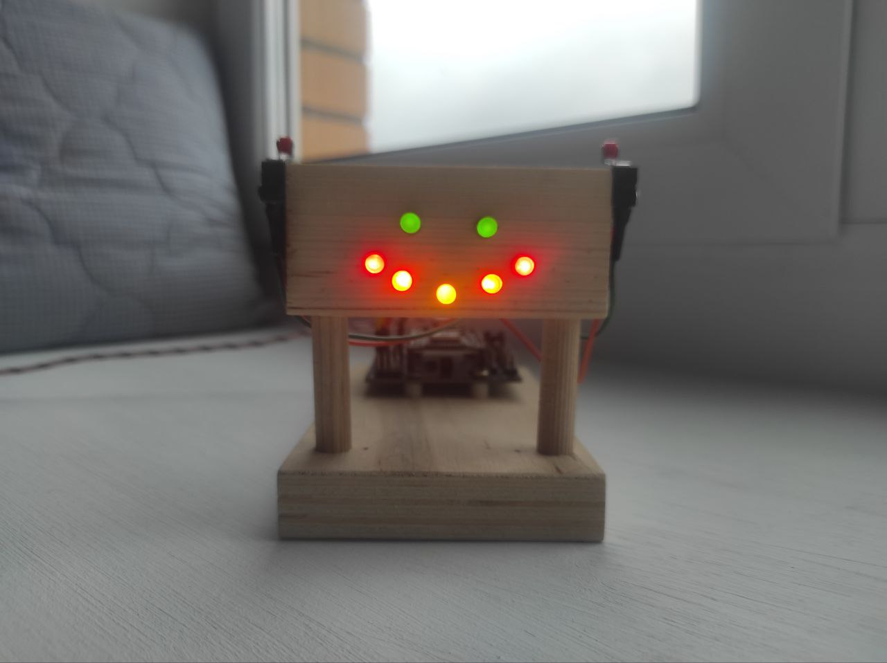
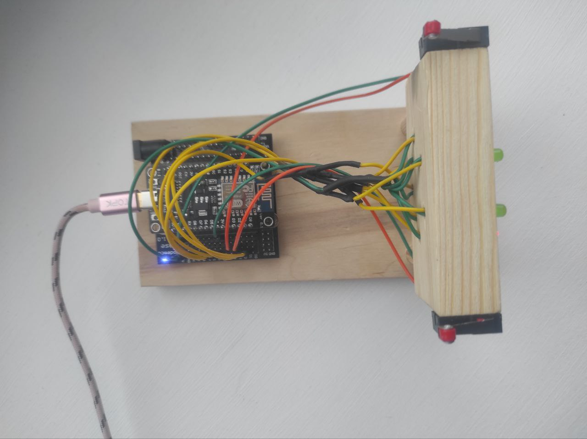
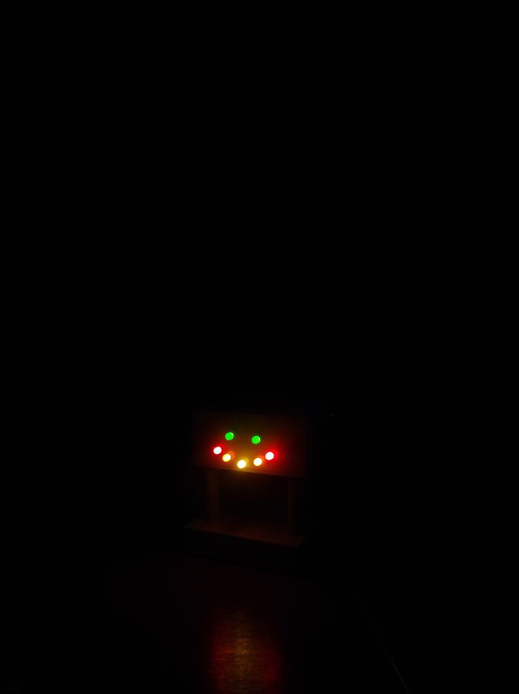

# Описание

Головоломка с несколькими уровнями. Управление на двух кнопках.

При прохождение последнего уровня - все светодиоды выключаются на 30 секунд.

# Распиновка

| Wire            |  Pin   |
| --------------- | ------ |
| Green Wires     | Ground |
| Yellow Led      | D1     |
| Orange Led      | D2     |
| Red Led         | D5     |
| Left Green Eye  | D6     |
| Right Green Eye | D7     |
| Left Knob Ear   | D3     |
| Right Knob Ear  | D4     |

# Фотографии

